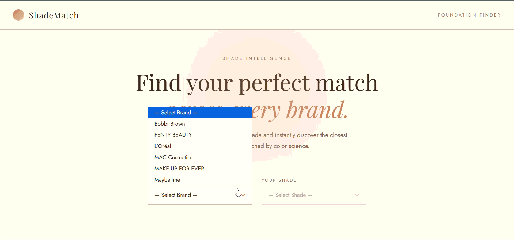

# ShadeMatch 💄

A full-stack web app that finds your foundation shade match across makeup brands — powered by color science, not guesswork.

Select your current foundation shade and instantly discover the closest equivalents from other brands, ranked by match percentage using a hex color distance algorithm.


---



---

## How it works

1. Select your brand and shade from the dropdown
2. The app sends your shade's hex color to the backend
3. The algorithm computes the color distance between your shade and every other shade in the database
4. Results are returned ranked by match percentage, with hex values shown

---

## Tech Stack

**Frontend**
- React + Vite
- Tailwind CSS
- Deployed on Vercel

**Backend**
- Java Spring Boot
- PostgreSQL
- Deployed on Render

---

## Project Structure

```
ShadeMatch/
├── frontend/
│   ├── src/
│   │   ├── api/          # API calls to backend
│   │   ├── components/   # Navbar, ShadeSelector, ResultsGrid, ShadeCard, Hero
│   │   ├── utils/        # Helper functions
│   │   └── App.jsx
└── backend/
    └── src/main/java/com/shadematch/backend/
        ├── controller/   # REST endpoints
        ├── service/      # Business logic + color matching
        ├── repository/   # Database access
        ├── model/        # Entity classes
        └── dto/          # Data transfer objects
```

---

## Running Locally

### Prerequisites
- Node.js
- Java 17+
- PostgreSQL

### Frontend
```bash
cd frontend
npm install
npm run dev
```

### Backend
```bash
cd backend
./mvnw spring-boot:run
```

Set these environment variables before running the backend:
```
SPRING_DATASOURCE_URL=jdbc:postgresql://localhost:5432/shadematch
SPRING_DATASOURCE_USERNAME=your_username
SPRING_DATASOURCE_PASSWORD=your_password
```

---

## Data

Shade data is sourced from [The Pudding's foundation shade dataset](https://github.com/the-pudding/data/tree/master/makeup-shades), which compiled foundation shades and hex values from major makeup brands.

---

## Limitations

- Dataset covers a limited number of brands — not every foundation on the market is included
- Color matching is based on hex distance in RGB space, which doesn't account for undertones (warm/cool/neutral)
- Shade names and product lines may be outdated as brands update their ranges

---

## What's next

- [ ] Undertone-aware matching
- [ ] More brands and expanded dataset
- [ ] Filter results by finish (matte, dewy, satin)
- [ ] Save your shade profile

---

## Acknowledgements

Data sourced from [The Pudding](https://pudding.cool/) — full credit to their research and data collection work.
